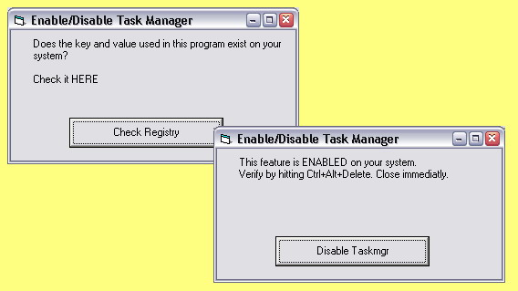



## WIN XP CTRL\_ALT\_DEL

### Description

CTRL+ALT+DE can be used in WinXP to invoke the task manager. But non bonafide software companies include a disable of this feature to prevent users from terminating their hidden adware/spyware. I know because they 'got' me!

It took me hours to discover he trick. An exclusive for the PSC community in return for all the goodies I received. A special thanks for Evan Toder who informed us of tools that helped me solve the riddle. UPDATED (tip of Roger Gilchrist)
 
### More Info
 

             |
---                |---
**Submitted On**   |2004-10-19 21:42:02
**By**             |[Paul Turcksin](https://github.com/Planet-Source-Code/PSCIndex/blob/master/ByAuthor/paul-turcksin.md)
**Level**          |Beginner
**User Rating**    |5.0 (30 globes from 6 users)
**Compatibility**  |VB 6\.0
**Category**       |[Windows System Services](https://github.com/Planet-Source-Code/PSCIndex/blob/master/ByCategory/windows-system-services__1-35.md)
**World**          |[Visual Basic](https://github.com/Planet-Source-Code/PSCIndex/blob/master/ByWorld/visual-basic.md)
**Archive File**   |[WIN\_XP\_CTR18079510192004\.zip](https://github.com/Planet-Source-Code/paul-turcksin-win-xp-ctrl-alt-del__1-56805/archive/master.zip)

